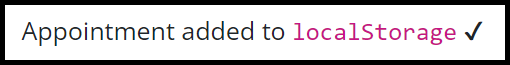
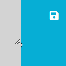
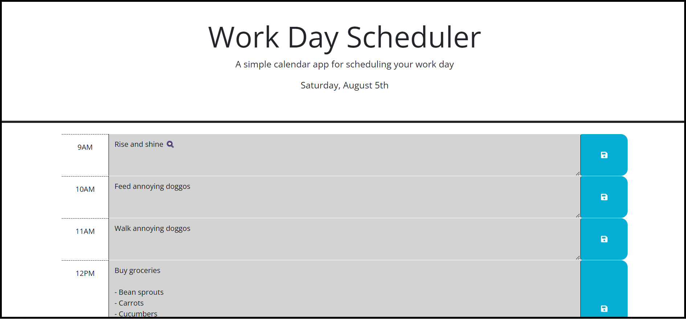
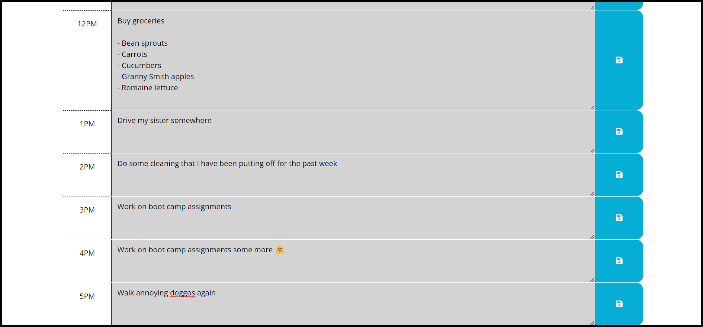
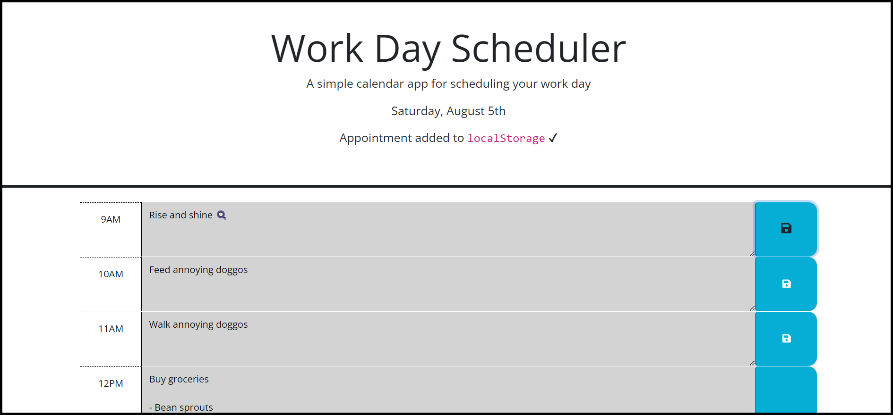

# Challenge 5: Dynamic Daily Planner

## Description
In a typical day, there are often a bunch of different events to keep track of. It can be difficult to store this information mentally, which makes it important to have a daily planner app. This project allows the user to write events in text boxes. Each hour block has its own text box, and each box can be expanded vertically to allow for more writing space. The flexible box height allows the user to write special notes or guidelines associated with their events - for example, the event "Buy groceries" can be followed by a list of grocery items. Clicking the save button will save your answers in localStorage, and your answers will remain in their respective slots even after the page is refreshed or reloaded. This project taught me how to add classes to divs, use jQuery selectors and functions to point to specific elements and their attributes, and obtain information about the current time using the dayjs library.

## Table of Contents
- [Description](#description)
- [Installation](#installation)
- [Usage](#usage)
- [Credits](#credits)
- [Contributing](#contributing)
- [Tests](#tests)
- [Questions](#questions)

## Installation
No installation is required for this project.

## Usage
Write your events in the text boxes to the left of the save buttons. When you are satisfied with your answers and you would like to save them for the future, click the save button. This will reveal a notification at the top of this page that says: 

The notification will stay on the screen for 4-5 seconds, then disappear. Clicking the save button saves your input to localStorage, which means that your most recent events saved in a time block will remain in that block after the page is refreshed.

**Note:** you can change the height of the text boxes by clicking on the triangle icon in the bottom right corner:

Dragging the icon upwards compresses the text box, dragging it downwards expands the box.

The following screenshots demonstrate the appearance of the application:

## Credits
Asked questions in the *#02-ask-the-class* channel on Slack and received assistance from TA Michael Seaman and instructor Robbert Wijtman.

The following web resources helped me write the code for this project:

1. [Resize property in CSS](https://www.w3schools.com/cssref/css3_pr_resize.php)
2. [jQuery: children() and parent() functions](https://www.digitalocean.com/community/tutorials/jquery-parent-and-children-tree-traversal-functions-example)
3. [How to use localStorage](https://www.w3schools.com/jsref/prop_win_localstorage.asp)
4. [Using '$(this)' to enable jQuery functionality](https://www.geeksforgeeks.org/difference-between-this-and-this-in-jquery/)
5. [jQuery: getting an element's id](https://stackoverflow.com/questions/3239598/how-can-i-get-the-id-of-an-element-using-jquery)
6. [jQuery: finding an element's siblings](https://stackoverflow.com/questions/7463242/how-do-i-select-a-sibling-element-using-jquery)
7. [Getting the current value from a textarea div using val()](https://www.geeksforgeeks.org/how-to-get-the-value-of-a-textarea-in-jquery/)
8. [Stack Overflow: How to reset a timer when a button is clicked](https://stackoverflow.com/questions/18607623/reset-timer-on-click-for-show-and-hide-jquery)
9. [jQuery: getting an element's CSS properties](https://www.tutorialrepublic.com/jquery-tutorial/jquery-get-and-set-css-properties.php)
10. [dayjs: getting the current hour](https://day.js.org/docs/en/get-set/hour)
11. [Converting a string into a number](https://dev.to/sanchithasr/7-ways-to-convert-a-string-to-number-in-javascript-4l)
12. [jQuery: adding classes to elements](https://www.w3schools.com/jquery/jquery_css_classes.asp)
13. [textarea value property](https://www.w3schools.com/jsref/prop_textarea_value.asp)
14. [Endings for ordinal (position) numbers](https://byjus.com/maths/ordinal-numbers/)
15. [How to use jQuery selectors](https://www.w3schools.com/jquery/jquery_selectors.asp)
16. [dayjs: date formatting options](https://day.js.org/docs/en/display/format)
17. [dayjs: how to get the current day of the month](https://day.js.org/docs/en/get-set/date)

## Contributing
Contribution is not necessary for this project.

## Tests
Tests have not been written for this application.

## Questions
If you have any questions for me, you can [follow me on GitHub](https://github.com/GimmeKitties711) or email me at eric20wang.wang@gmail.com.
